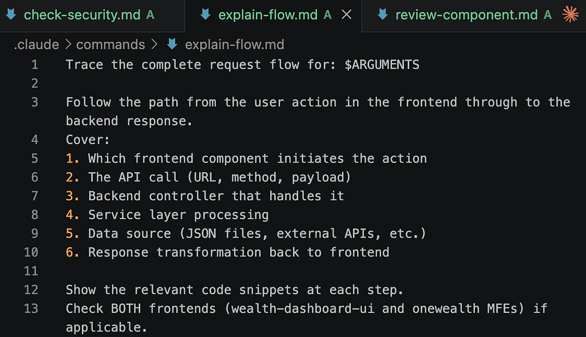

# AI Agent Engineering

*Developer Tools, MCP, RAG, and Agentic Patterns with Claude Code*

*By Arunkumar Velusamy · Apr 2026*

---

Slash Commands, Subagents, Hooks,RAG, MCP and etc

## Custom Slash Commands

/review-component src/components/Dashboard  
/check-security  
/explain-flow fetching bank portfolio data

These commands are defined in .claude/commands/ — open them to see how they work.




## Plan mode

/plan Add a new "Insurance" asset type across the entire platform

- Review the plan Claude creates
- Modify it ("skip the frontend changes for now")
- Approve or /exitplan

## Checkpoints & Rewind

You: Add a todo comment to the top of CLAUDE.md  
Claude: [Make the changes]  
you: /rewind  
[select the checkpoint to undo the change]

## Context & Compaction

/context  
/compact

## Memory

You: Remember that I prefer to see the git diffs before every commit  
You : Remember that our spring ends on April 15 2026  
You: /memory  
[View the saved]

## Subagents

You: Explore how the websocket streaming works end to end  
You: In the background, analyse all bank JSON files for schema consistency

## Worktrees

You: In a worktree, try adding a "Last Refreshed" timestamp to the portfolio response.  
This runs in isolation. your working directory stays clean

## TodoWrite

You: I need you to add OCBC as a new bank. Track your progress with tasks.  
Watch claude creat a task list and check items off as it works

## Hooks (observe)

The hooks in .claude/settings.json. When claude modifies a file, you'll see PreToolUse and PostToolUse messages in the output.

## Cost & Usage

/cost  
[Sees tokens used and estimated cost for this session]

## AGENTS.md in Action

You: Explore the authentication flow across both frontends  
The spawned agent will follow the instructions in AGENTS.md

## SKILL.md

Skill is a structured, reusable workflow the agent can execute. Reusable capabilities / workflows. A Skill knows how to deploy a microservice to kubernetes

## Settings Override

Try modifying .claude/settings.local.json to deny a specific tool:

```json
{
 "permissions": {
 "deny": ["Bash(git push*)"]
 }
}
```

Then ask Claude to push — it will be blocked.

## MCP

MCP (Model Context Protocol) is an open standard from Anthropic that lets AI assistants connect to external tools, data, and systems through a universal interface — like "USB-C for AI." It uses a client-server architecture where MCP servers expose **tools** (functions to call), **resources** (data), and **prompts** (templates) over JSON-RPC, so any MCP-compatible client (Claude Code, Cursor, etc.) can use any MCP server without custom integrations.

## RAG

RAG (Retrieval-Augmented Generation) fetches relevant information from an external knowledge source at query time and feeds it to an LLM as context, so the model can generate answers grounded in up-to-date or private data instead of relying only on its training. The pipeline is: chunk and embed documents into a vector store, then at query time retrieve the most semantically similar chunks and stuff them into the LLM's prompt. It solves hallucinations, stale knowledge, and lack of access to proprietary data without the cost of retraining.

### Plugins

Agent plugins are modular packages that extend AI agents or development environments with reusable skills, hooks, and integrations to automate tasks and enhance functionality

### Guardrails

Any mechanism that enforces hard boundaries on what AI can do, regardless of what AI thinks it should do.

### Human in the loop

Human in the loop (HITL) is another conceptual pattern, not a single feature. It's about where and how a human gets to approve, redirect, or reject what AI is doing during an agentic task.
