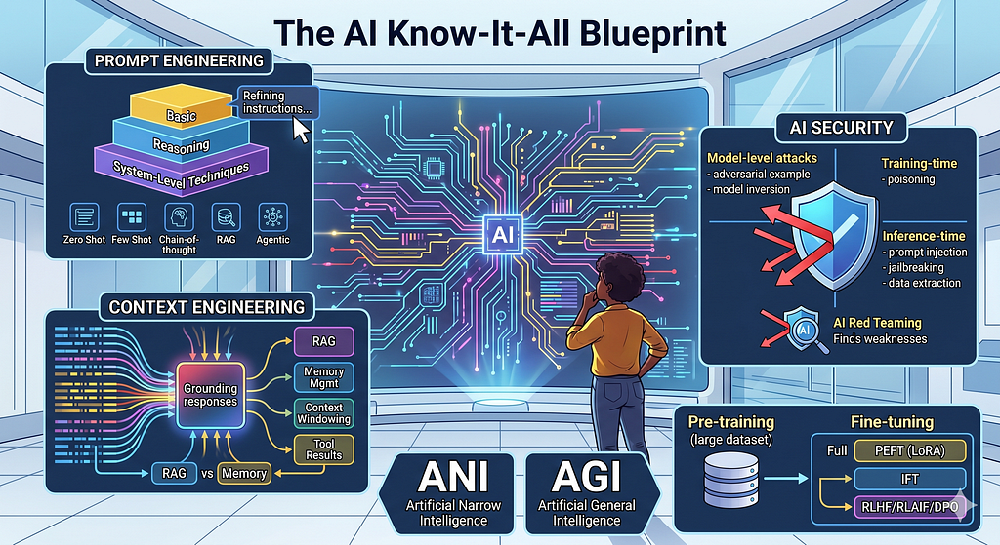
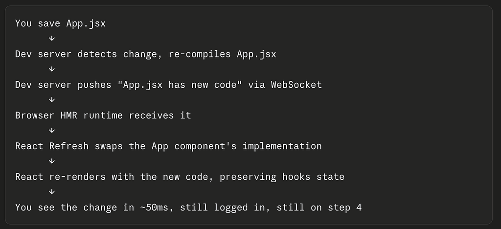
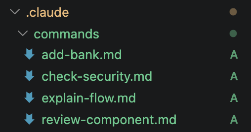
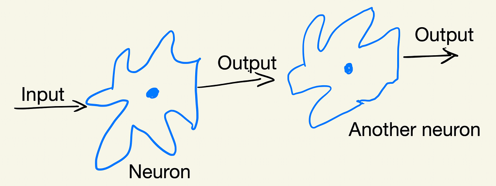
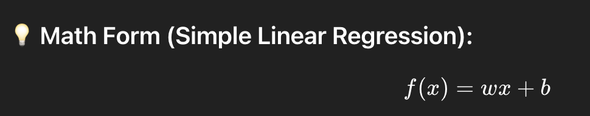
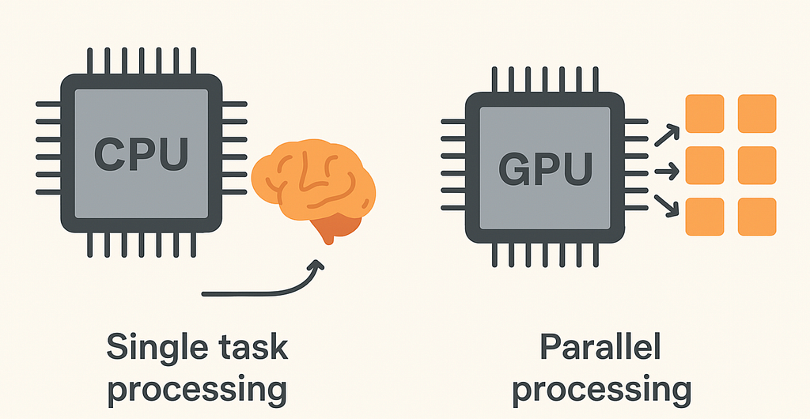
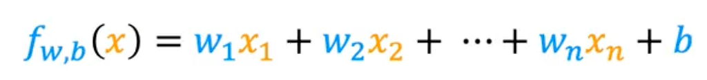
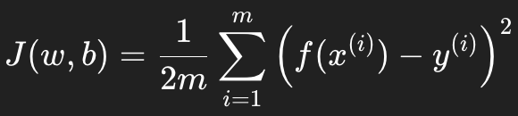

  <header class="blog-feed-head">
    <h1>Blogs</h1>
    
Notes and long-form writing, mirrored from my Medium.

  </header>

  <article class="blog-card">
    <a class="blog-card-link" href="../market-indicators/">
      

        

          
          Arunkumar Velusamy
        

        <h2 class="blog-card-title">Market Indicators</h2>
        
Raw notes used to play around with AI models — weekend reading material on markets. A tour through fund-manager surveys, sentiment gauges, valuation ratios and the three deficits.

        

          Jun 2026
          &middot;
          27 min read
          
        

      

      

        
      

    </a>
  </article>

  <article class="blog-card">
    <a class="blog-card-link" href="../ai-terms/">
      

        

          
          Arunkumar Velusamy
        

        <h2 class="blog-card-title">AI Terms</h2>
        
An Attempt to Know It All When we read about AI topics, we realise we will never know them all. It is just overwhelming. This blog is just one of my many attempts to…

        

          May 2026
          &middot;
          5 min read
        

      

      

        
      

    </a>
  </article>

  <article class="blog-card">
    <a class="blog-card-link" href="../frontend-revisited/">
      

        

          
          Arunkumar Velusamy
        

        <h2 class="blog-card-title">Frontend Revisited</h2>
        
A Developer’s Fresh Take on Modules, React, Bundlers and Micro-frontends Browser’s progress over the years 25–30 years ago, browser just opens HTML and reloads entire page for any change… like a document viewer. But…

        

          May 2026
          &middot;
          6 min read
        

      

      

        
      

    </a>
  </article>

  <article class="blog-card">
    <a class="blog-card-link" href="../agent-engineering/">
      

        

          
          Arunkumar Velusamy
        

        <h2 class="blog-card-title">AI Agent Engineering</h2>
        
Developer Tools, MCP, RAG, and Agentic Patterns with Claude Code Slash Commands, Subagents, Hooks,RAG, MCP and etc Custom Slash Commands /review-component src/components/Dashboard /check-security /explain-flow fetching bank portfolio data These commands are defined in .claude/commands/…

        

          Apr 2026
          &middot;
          3 min read
        

      

      

        
      

    </a>
  </article>

  <article class="blog-card">
    <a class="blog-card-link" href="../neural-networks/">
      

        

          
          Arunkumar Velusamy
        

        <h2 class="blog-card-title">Neural Networks Demystified</h2>
        
Layers, Neurons, Activations, and Forward Propagation Computational model inspired by the human brain It will be hard to put everything into one single blog. Just want to keep it simple for quick reference. For…

        

          Jan 2026
          &middot;
          2 min read
        

      

      

        
      

    </a>
  </article>

  <article class="blog-card">
    <a class="blog-card-link" href="../supervised-machine-learning-classification/">
      

        

          
          Arunkumar Velusamy
        

        <h2 class="blog-card-title">Supervised Machine Learning — Classification</h2>
        
Logistic Regression &amp; Classification From Sigmoid Functions to Decision Boundaries Classification is about predicting categories or labels, not continuous values. Instead of predicting a number like price (regression), you predict which class something belongs…

        

          Sep 2025
          &middot;
          3 min read
        

      

      

        
      

    </a>
  </article>

  <article class="blog-card">
    <a class="blog-card-link" href="../gpu/">
      

        

          
          Arunkumar Velusamy
        

        <h2 class="blog-card-title">GPU?</h2>
        
Start with Core. What is core? There are genius people talk about single core , dual core, quad core and multi-core. Let start from here, Single Core Only one core was responsible for all…

        

          Sep 2025
          &middot;
          4 min read
        

      

      

        
      

    </a>
  </article>

  <article class="blog-card">
    <a class="blog-card-link" href="../regression-with-multiple-input-variables/">
      

        

          
          Arunkumar Velusamy
        

        <h2 class="blog-card-title">Multiple Linear Regression</h2>
        
Vectorization, Feature Scaling, and Polynomial Regression Read the previous blog before start this Multiple feature When you started having multiple features, your function will become bigger. For example, To predict house price, we can…

        

          Jul 2025
          &middot;
          3 min read
        

      

      

        
      

    </a>
  </article>

  <article class="blog-card">
    <a class="blog-card-link" href="../machine-learning-get-start/">
      

        

          
          Arunkumar Velusamy
        

        <h2 class="blog-card-title">Machine Learning — Get start</h2>
        
Linear Regression &amp; Gradient Descent The Foundation of Supervised Machine Learning As I progress through the Supervised Machine Learning course by Andrew Ng on Coursera, I wanted to document my understanding of one of…

        

          Jun 2025
          &middot;
          4 min read
        

      

      

        
      

    </a>
  </article>

  <article class="blog-card">
    <a class="blog-card-link" href="../ai-frameworks/">
      

        

          
          Arunkumar Velusamy
        

        <h2 class="blog-card-title">AI Toolbox</h2>
        
Essential Frameworks, Libraries, and Data Formats Explained in Two Lines PyTorch Open-source deep learning framework developed by Meta. It is widely used for machine learning (ML) and deep learning (DL) applications, such as computer…

        

          Feb 2025
          &middot;
          4 min read
        

      

    </a>
  </article>

  <article class="blog-card">
    <a class="blog-card-link" href="../ai-models/">
      

        

          
          Arunkumar Velusamy
        

        <h2 class="blog-card-title">AI Models at a Glance</h2>
        
A quick reference to the main AI model families — Machine Learning (supervised, unsupervised, reinforcement), Deep Learning (CNNs, RNNs, Transformers), and Generative AI (GANs, diffusion, LLMs).

        

          Feb 2025
          &middot;
          1 min read
        

      

    </a>
  </article>

  <article class="blog-card">
    <a class="blog-card-link" href="../auth-signing-in/">
      

        

          
          Arunkumar Velusamy
        

        <h2 class="blog-card-title">Authentication Demystified</h2>
        
Authentication vs authorization, OAuth 2.0 and OpenID Connect, and how Single Sign-On ties login sessions, IdP cookies and multi-domain access together.

        

          Sep 2024
          &middot;
          5 min read
        

      

    </a>
  </article>

  <article class="blog-card">
    <a class="blog-card-link" href="../artificial-intelligence-intro/">
      

        

          
          Arunkumar Velusamy
        

        <h2 class="blog-card-title">Understanding the AI Landscape</h2>
        
How AI, Machine Learning, Deep Learning, Generative AI and Data Science fit together — from traditional rule-based systems to modern learning-based approaches.

        

          Sep 2024
          &middot;
          3 min read
        

      

    </a>
  </article>

  <article class="blog-card">
    <a class="blog-card-link" href="../dns-domain-name-system/">
      

        

          
          Arunkumar Velusamy
        

        <h2 class="blog-card-title">DNS — Domain Name System</h2>
        
How the Domain Name System turns human-friendly names like www.google.com into IP addresses — TLDs, SLDs, FQDNs, subdomains, and how resolution works.

        

          Aug 2024
          &middot;
          2 min read
        

      

    </a>
  </article>

  <article class="blog-card">
    <a class="blog-card-link" href="../aws-serverless/">
      

        

          
          Arunkumar Velusamy
        

        <h2 class="blog-card-title">AWS Serverless</h2>
        
Running code in the cloud without managing servers — Lambda, DynamoDB, Cognito, API Gateway, event-driven design and pay-per-execution pricing.

        

          Oct 2023
          &middot;
          2 min read
        

      

    </a>
  </article>

  <article class="blog-card">
    <a class="blog-card-link" href="../aws-infrastructure-as-code/">
      

        

          
          Arunkumar Velusamy
        

        <h2 class="blog-card-title">AWS — Infrastructure as Code</h2>
        
Managing infrastructure through machine-readable definition files — comparing Elastic Beanstalk, CloudFormation, SAM and the AWS CDK.

        

          Oct 2023
          &middot;
          2 min read
        

      

    </a>
  </article>

  <article class="blog-card">
    <a class="blog-card-link" href="../observability-in-aws/">
      

        

          
          Arunkumar Velusamy
        

        <h2 class="blog-card-title">Observability in AWS</h2>
        
Why and what to monitor in production — CloudWatch metrics, logs and events, EventBridge, CloudTrail auditing, and X-Ray tracing across microservices.

        

          Aug 2023
          &middot;
          9 min read
        

      

    </a>
  </article>

