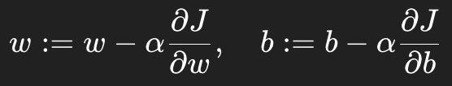
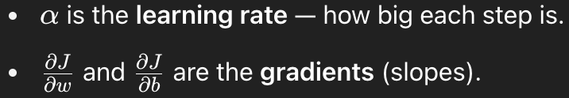
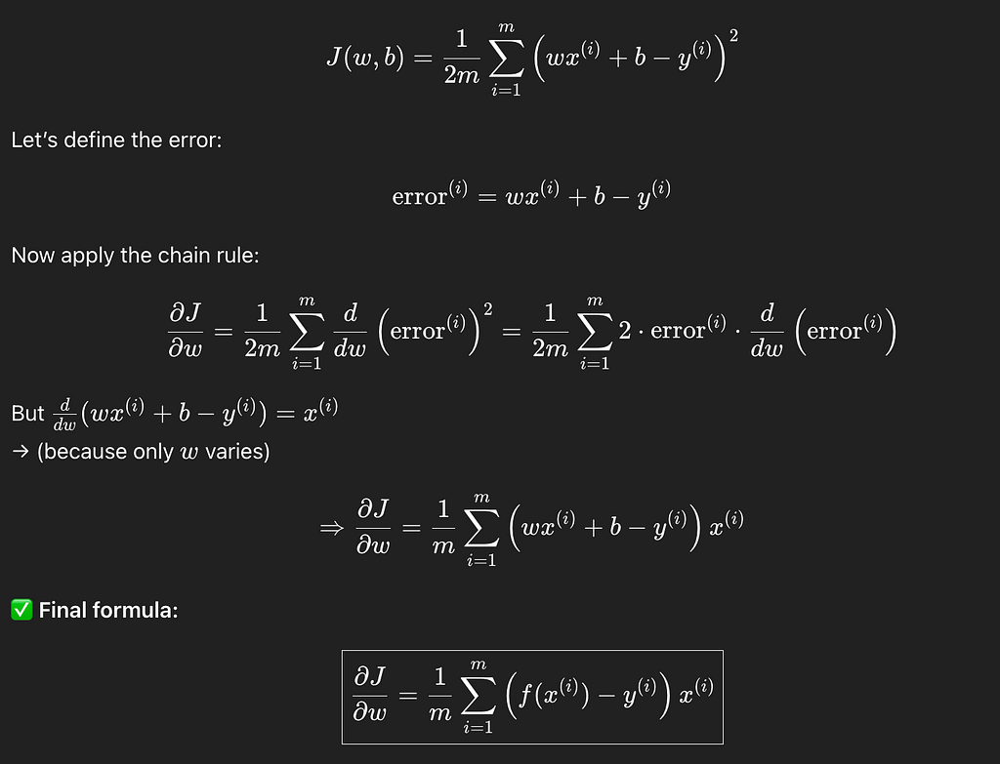
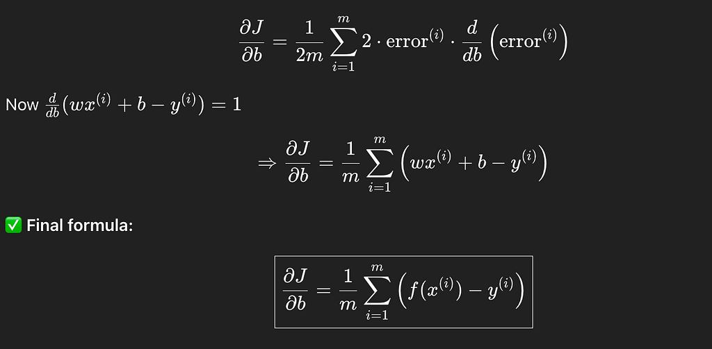
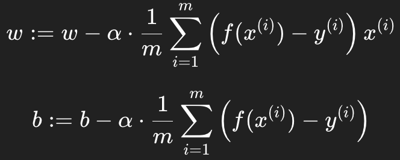

# Machine Learning — Get start

*By Arunkumar Velusamy · Jun 2025*

---

## Linear Regression & Gradient Descent

### The Foundation of Supervised Machine Learning

As I progress through the *Supervised Machine Learning* course by Andrew Ng on Coursera, I wanted to document my understanding of one of the core topics: **Gradient Descent for Linear Regression**.

## What Problem Are We Solving?

We’re trying to train a machine learning model that predicts a numerical output y from an input x, using a **straight line**:

*f(x)=wx+b*

Where, w is the slope (weight), b is the y-intercept (bias).

This is a linear function. we can have multivariable linear regression also to represent line. This is to represent a simple function which take input and give output.

The goal is to **find the best values of w and b** that minimize the difference between predicted values and actual values from the **training data**.

## Why **Linear Regression** to Introduce Machine Learning?

It’s Simple Yet Powerful.Linear regression uses a **straight line** to predict outputs based on inputs.It’s easy to visualize and understand.

*f(x)=wx+b*

Supervised machine learning **doesn’t have to be a straight line** at all. It can be different as well. The **core idea** of supervised learning is learning a function that maps inputs x to outputs y using labeled training data.Straight Line (Linear Regression) is Just One Case.

Linear regression is like **learning to ride a tricycle** before you jump on a motorbike — it teaches you the balance of ML concepts in a friendly and intuitive way.

## Cost function

Cost function tells machine how wrong its predictions are. So it knows how to improve. The most common cost function is **Mean Squared Error (MSE),** given below J(w,b).

### Why Do We Need a Cost Function?

You give the model some data. Inputs x and correct outputs (labels) y. It learns a function f(x) that predicts y from x. Now, how do we know if our model is **good or bad** at this job?

That’s where the **cost function** comes in. Just look at the above formula J(w,b) once again.

m is the number of training data. f(x) is the model prediction. y is the actual output. So it is just average of all squared prediction errors.

### Why square error?

Makes all errors positive (so they don’t cancel out)  
Punishes large errors more harshly

### Why Do We Minimize the Cost?

Because a **lower cost = better predictions**.

So, Cost function is a formula to measure model error.

### Why are we dividing by 2 again?

It’s mostly for **mathematical convenience**. To cancel out the 2 from the derivative of the square term.

Does it change the learning? Nope — just makes math cleaner  
Is it required? — No, but it’s convention — most people do it for convenience

## Gradient Descent Algorithm

Gradient Descent is an algorithm that helps your model **learn by adjusting the parameters** (like weights w, bias b) to **minimize the cost function**.

### Why Gradient Descent?

If we keep applying values for parameters one after another, somewhere we will get the minimum value of mean squared error. So why do we need any algorithm such as gradient descent?

If we apply different value for w and b , we will continur to find low cost value. But How many value we can try applying for w and b. It is infinite(like 0, 0.1, 0.01,…, 1, .. infinity). It is like trying every grain of sand on a beach to find the one with a smiley face on it. Imagine a neural network with millions of parameters. not feasible to try them all.

**Instead of searching Blindly,** gradient descent uses calculus to look at the slope of the cost function & say “This cost is decresing most rapidly in this direction- let’s go that way”

- **Brute force:** Wandering randomly through a forest.
- **Gradient Descent:** Using a compass and GPS to head downhill with purpose.

Where,

### Derivative with respect to w:

### Derivative with respect to b:

## Gradient Descent Algorithm (Full Form)

**Initialize**: w=0, b=0(or random small numbers)  
**Repeat** (for many steps):

- Compute the partial deriv
- Update parameters

After each update w and b should get slightly better.

The learning rate α(alphaα) is **a number that controls how big the steps** are during gradient descent.It is **NOT calculated** from a formula based on the data.you have to **choose it yourself**.

Finding a good α(alphaα) is far easier than brute-forcing all possible w and b values. You don’t need the *perfect* α(alphaα), just one that’s *good enough* to reach convergence. In many problems, a wide range of α\alphaα values will work fine. This is the same idea as: Even though there’s no perfect cooking temperature, you can still bake a cake if you’re in the right range (say 170–180°C).

Think of this move like **delegating a hard task** to a reliable helper:

- The original search space is massive and chaotic.
- Gradient descent takes care of the hard navigation.
- Your job becomes: pick a reasonable speed for the helper (i.e., α(alphaα)).

That’s a good trade-off in almost all real-world cases.

[Read the next blog](https://medium.com/@arun003.v/regression-with-multiple-input-variables-926408bbe91c) to continue further on the related topics
