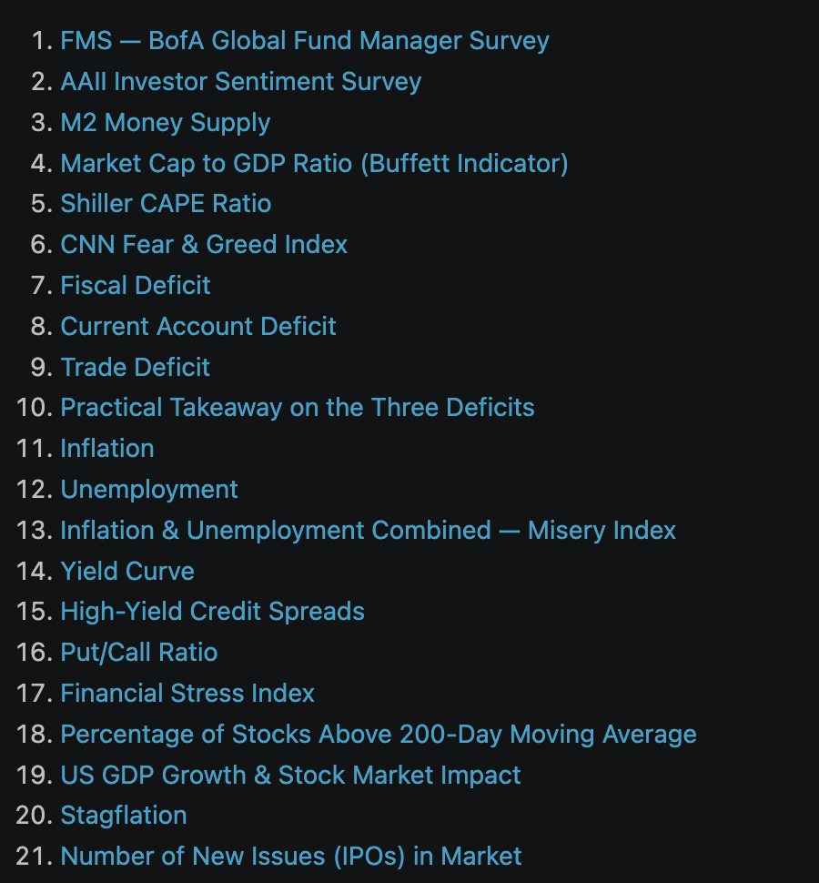

# Market Indicators

*By Arunkumar Velusamy · June 2026*

---

This is just an attempt at writing something outside of technology, with some (or more) help from Claude, Gemini, and ChatGPT & trying to put things together that I used to read over the weekends. These are just raw notes used to play around with AI models in various ways.

## FMS — BofA Global Fund Manager Survey

Monthly survey in which BofA (Bank of America) polls hundreds of institutional investors (the people running big mutual funds, pension funds, hedge funds, etc.) about how they’re positioning their portfolios.

### Contrarian indicator

Investors and traders use these as contrarian sentiment indicators. FMS Cash Levels tracks the average percentage of cash held by fund managers.

**Low cash (below ~4%)** = managers are fully invested and bullish → historically a *sell signal* for stocks, because there’s little spare money left to push markets higher and sentiment is “too” optimistic.

**High cash (above ~5%)** = managers are scared and hoarding cash → historically a *buy signal*.

### May 2026 BofA Global Fund Manager Survey

Cash levels dropped to 3.9% in May from 4.3% in April — the biggest monthly drop since February 2024 — and a reading below 4.0% triggers a sell signal for global equities.

Equity allocations are at a net 50% overweight.   
cash at 3.9%  
The Bull & Bear Indicator at 7.8  
Fund managers just made their biggest one-month rush into stocks on record

On the historical track record:  
The median 4-week loss for global stocks after the 24 sell signals since 2011 is -1%  
Biggest recorded loss at -29% and biggest gain 4%

Since 2011, BofA’s cash rule has triggered a “sell signal” **24 times** (cash dropping below 4% = managers too bullish). Each time it fired, BofA recorded what global stocks did over the **next 4 weeks** (about a month). So they have 24 historical “experiments” to look back on. The May 2026 trigger is just the latest one.

Median 4-week loss is -1%: Take all 24 outcomes and line them up from worst to best. The **median** is the middle one — half the outcomes were worse, half were better. That middle value is **-1%**, meaning stocks were down about 1% a month after the signal, on a typical occasion.

Biggest recorded loss at -29%: Of those 24 times, th**e worst** outcome was stocks falling 29% over the following 4 weeks. That’s a genuine crash — almost certainly the COVID crash of March 2020, when a sell signal happened to fire right before markets collapsed.

Biggest gain 4%*: Of those 24 times, thebestoutcome was stocks rising* 4% over the next 4 weeks. In other words, sometimes the sell signal fired, and stocks just kept climbing anyway. The signal was “wrong” that time.

### Putting it together

So the range of historical outcomes after this signal runs from **-29% (worst) to +4% (best)**, with the **typical case being a mild 1%**. What this tells you:

The signal has a slight **bearish lean** — more often modestly negative than positive.

But it’s a **weak edge**, not a reliable predictor. A typical 1% is barely a blip, and sometimes stocks rose.

This is the data-driven reason these signals are treated as “be cautious” indicators rather than “sell everything now” commands.

The real value is as a **risk flag**: it rarely goes wrong, but on the rare occasions it does (like 2020), the downside can be severe. That asymmetry — small typical loss, occasional huge loss

## AAII Investor Sentiment Survey

Polls retail (individual) investors weekly on bullish/bearish.Pairs nicely with the BofA survey. It is also viewed by many as a contrarian indicator. AAII — American Association of Individual Investors. The historical averages are 37.5% bullish, 31.5% neutral, 31.0% bearish. At 35.6%. The “bull-bear spread” is negative (35.6% − 41.9% = −6.3 points), meaning bears outnumber bulls.

### AAII Investor Sentiment Survey — 27th May 2026

Bullish sentiment increased 3.8 percentage points to 35.6%. Neutral sentiment decreased 2.1 percentage points to 22.6%. Bearish sentiment decreased 1.8 percentage points to 41.9%.

## M2 Money Supply

**M2** is a measure of the money supply that includes **M1** (physical cash, coins, demand deposits, checking accounts), savings accounts, money market accounts, small-denomination time deposits, and retail money market mutual funds.

### M2 Money supply growth rate

US M2 Money Supply Data for April 2026 is $22,804.50 billion. The year-over-year (YoY) growth rate as of April 2026 stands at 4.72%. 4.7% YoY M2 Growth is generally a Bullish Signal.

25–40% growth during the 2020–2021 COVID stimulus. There was a stock market rally during this period. In 2022–2023, it was negative during the quantitative tightening, peaking at -8.36% in nov 2023. Significant equity and bond market drawdowns during this period.

## Market Cap to GDP ratio(Buffett indicator)

As of late May 2026, the indicator is at a record high. It is 235%.

Annualised US GDP: ~$31.82 Trillion  
Total US Stock Market Value: ~$75.05 Trillion  
Buffett Indicator: 235.9%

For context, the long-term average is around 163%, the median is about 81%, and the typical historical range is roughly 133% to 194%. So the current reading is well above any normal band. It is suggesting the market is “strongly overvalued.”

Important limitations of this indicator:   
- US companies earn significant revenue overseas, which inflates market cap relative to purely domestic GDP.  
- Interest rate levels affect what counts as “fair” valuation — lower rates justify higher valuations.  
So it’s a “weather pattern,” not a trigger.

## Shiller CAPE ratio

The CAPE ratio (Cyclically Adjusted Price-to-Earnings ratio), also called the Shiller P/E.It divides the current S&P 500 price by the average of the last 10 years of inflation-adjusted earnings. The latest data show it is well above 40 now, roughly 2.4x the historical average.

A CAPE above 40 has only been recorded twice. The first was at the dot-com peak in December 1999, when the ratio hit 44.19 before the index lost roughly half its value over the following two and a half years. The second is now.

It is not a crash predictor. Valuations can stay elevated for years.

## CNN Fear & Greed Index

The CNN Fear & Greed Index is a market sentiment gauge built on the idea that emotion drives short-term price moves. It’s calculated from seven equal-weighted indicators.

It is 60, in the “Greed” zone. The zones are usually broken into Extreme Fear (0–25), Fear (25–45), Neutral (45–55), Greed (55–75), and Extreme Greed (75–100). At 60, the market is in moderate Greed.

## Fiscal deficit

The government’s total expenditure exceeds its total revenue during a financial year. It essentially represents how much the government needs to borrow to cover the gap between what it earns and what it spends.

So, the fiscal deficit is the one with the most direct market link, and it works mainly through bonds. Large, growing deficits mean the Treasury issues more debt. Heavy supply plus debt crossing 100% of GDP and $1T+ in interest costs can push up long-term yields (the 10-year and 30-year).

Higher yields hurt stocks in two ways: they raise the discount rate used to value future earnings (most punishing for high-growth/tech names) and make bonds a more attractive alternative to equities.

The tail risk markets watch for is a “fiscal crisis” scenario — weak Treasury auctions or a credit-rating concern — which can spike yields and hit stocks sharply. Conversely, deficit spending is also stimulus, so in the short run, it can support corporate earnings and equity prices.

The market reaction depends heavily on *why* the deficit is growing (stimulus vs. just interest costs) and on inflation.

### Fiscal deficit data

Cumulatively, the federal government’s deficit for fiscal year 2026 totalled $955 billion at the end of April. For the full year, Treasury is estimating a $2.1 trillion deficit based on the President’s budget, while market participants are estimating about $2.0 trillion — up from the more than $1.8 trillion deficit logged last year.

That works out to more than 6% of GDP(GDP is around 30 trillion, so 2/30 is 6+ %) — about twice the 3% target, with debt passing 100% of the economy in March and interest spending on track to top $1 trillion this year(for the *total accumulated* *debt*28.6 trillion).

## Current Account Deficit

It occurs when a country’s total spending on foreign goods, services, and transfers is greater than its total income from foreign sources.

**Current Account = (Exports — Imports) + Net Income from Abroad + Net Current Transfers**

The latest quarterly figure (released March 25, 2026): the U.S. current-account deficit narrowed by $48.4 billion, or 20.2 percent, to $190.7 billion in the fourth quarter of 2025. The fourth-quarter deficit was 2.4 percent of GDP, down from 3.1 percent in the third quarter. The next update is due June 24, 2026

Current account deficit matters most through the dollar and foreign capital flows. A current account deficit must be financed by foreign capital inflows, much of which lands in U.S. stocks and bonds — that foreign demand has historically *supported* asset prices. The risk is the reverse: if foreign investors lose appetite for U.S. assets (a dollar-confidence question), it pressures both the currency and equities. The Q4 narrowing to 2.4% of GDP is generally read as a stabilising sign.

## Trade deficit

It occurs when a country imports more goods and services than it exports over a specific period.

Trade Balance} = Exports — Imports

It is a major part of a current account deficit — in fact, it is usually the largest and most influential component.

The most recent official figure is for March 2026: the goods-and-services trade deficit was $60.3 billion in March, up $2.5 billion from $57.8 billion in February. The goods deficit increased to $88.7 billion, and the services surplus increased to $28.4 billion.

Trade deficit has a weak and often counterintuitive link to stocks. A *widening* deficit usually reflects strong domestic demand (Americans buying more imports), which is often a sign of a healthy economy — generally fine for equities. The 2026 narrowing is tied to tariffs and shifting import patterns, so the bigger market driver isn’t the headline number but the *policy* behind it: tariff announcements move sectors (industrials, retailers, autos, semiconductors) far more than the deficit print itself. Currency matters too — a weaker dollar tends to widen the gap but helps large-cap multinationals’ overseas earnings.

## The practical takeaway of these three deficits

The fiscal deficit and its effect on interest rates are the variables equity markets currently watch most closely. The trade and current account figures tend to matter more as signals about growth, the dollar, and trade policy than as direct drivers of stock prices. And markets price in expectations ahead of time, so it’s usually *surprises* versus forecasts — not the absolute level — that move prices on release day.

## Inflation

The benchmark is 2%. The Fed has an explicit target of **2%**annual inflation. It is considered low enough that prices feel stable for consumers and businesses, but high enough to provide the economy with a buffer against deflation.

The annual CPI rate jumped to 3.8% in April 2026, the highest since May 2023, compared to 3.3% in March. Core CPI (excluding food and energy) rose 2.8% annually. The spike is largely an oil shock — energy costs jumped 17.9%, the steepest annual increase since September 2022, driven by the war with Iran, which pushed gasoline prices up sharply.

Markets care less about the inflation number and more about what they imply for interest rates and corporate earnings.

When inflation runs hot, central banks tend to keep interest rates high or raise them to cool the economy.

Higher rates hurt stocks in two ways. First, they raise the “discount rate” used to value future earnings — a company’s future profits are worth less in today’s dollars when rates are high, which compresses valuations (this hits high-growth and tech stocks hardest, since most of their value is in distant future earnings). Second, higher rates make bonds and cash more attractive relative to stocks, pulling money out of equities. High inflation also squeezes companies directly by raising input costs faster than they can raise prices, denting profit margins.

## Unemployment

The unemployment rate was unchanged at 4.3% in April, and the number of unemployed people changed little at 7.4 million. Nonfarm payrolls rose by 115,000, down from 185,000 in March but better than the 55,000 forecast. So the US has the uncomfortable combination of rising inflation alongside a softening (but still historically low) labour market.

*Low unemployment* signals a strong economy and healthy consumer spending, which is good for corporate revenue. But if it’s *too* low, it can stoke wage inflation, which feeds back into the inflation problem and keeps rates high.

*Rising unemployment* signals a slowing economy and weaker consumer demand — bad for earnings. But markets sometimes *rally* on it, because a weakening labour market gives the central bank room to cut rates.

There’s no zero-unemployment target — some unemployment is healthy and unavoidable (people switching jobs, new graduates job-hunting, etc.). Economists talk about the natural rate of unemployment, sometimes called NAIRU, which is the lowest unemployment can sustainably go before it starts pushing wages and inflation up. For the US, that natural rate is generally estimated around 4.0–4.5%.

## Putting inflation & unemployment together

The worst combination for stocks is high inflation *and* rising unemployment together — “stagflation” — because the central bank is trapped: cutting rates to fight unemployment would worsen inflation, and raising rates to fight inflation would worsen unemployment. The current US picture (inflation accelerating to 3.8% while job growth slows) is uncomfortably close to that tension, which is why these reports are being watched so closely.

One important caveat: markets are forward-looking and trade on the *surprise* relative to expectations, not the raw number. April US inflation came in at 3.8% versus an expected 3.7% — that small upside miss matters more to traders than the headline figure itself.

By these benchmarks, US unemployment (4.3%) is fine, but inflation (3.8%) is well above target. That mismatch is the problem. An economy that “looks fine” by both measures simultaneously would be something like ~2% inflation and ~4% unemployment at the same time — often nicknamed a “soft landing” or “Goldilocks economy” (not too hot, not too cold).

There’s even a rough rule of thumb called the **Misery Index** — just add the inflation rate and unemployment rate together. The US right now is about 3.8 + 4.3 = **8.1**. Historically, under ~8 feels comfortable, low single digits is great, and the stagflation era of the late 1970s hit the 20s. So 8.1 isn’t alarming, but it’s not the picture of an economy firing on all cylinders either — and the discomfort is coming almost entirely from the inflation side.

One caveat worth keeping in mind: these benchmarks aren’t fixed laws. The natural rate of unemployment, in particular, is an estimate that shifts over time with demographics and the structure of the economy, and economists genuinely disagree about where it sits.

## Yield Curve

A yield curve is a line that plots the interest rates (yields) of bonds with the same credit quality but different maturities — typically U.S. Treasury bonds ranging from a few months to 30 years.

**Normal (upward sloping)** — longer-term bonds pay higher yields than short-term ones. This is typical, since investors want extra compensation for locking up money longer and taking on more uncertainty.

**Inverted (downward sloping)** — short-term yields are *higher* than long-term ones. This is unusual and watched closely, because it has historically preceded recessions. It suggests markets expect rates (and growth) to fall in the future.

**Flat** — short and long yields are roughly equal, often signalling a transition or economic uncertainty.

The yield curve is one of the most-watched economic indicators. It reflects expectations about growth, inflation, and central bank policy, and it directly affects things like mortgage rates and borrowing costs.

### The Price and Yield Seesaw

A bond is essentially a contract with a fixed payout. If a 10-year bond is issued at a face value of $1,000 with a 5% coupon, it pays $50 a year. That $50 payout never changes.

When investors freak out about a future recession and flood the market to buy up these 10-year bonds, they compete with each other. This high demand drives the *bond's price* up on the secondary market (say, to $1,050).

Because a new buyer is now paying more ($1,050) to get that same fixed $50 annual payout, their actual rate of return — the **yield** — drops.

### Supply and Demand Dynamics

**At the Short End:** The Federal Reserve directly pins short-term rates high (e.g., 5.5%) by controlling the Federal Funds Rate. Short-term bonds (like 3-month Treasury bills) stay anchored close to this high number because they mature so quickly.

**At the Long End:** The market determines the pricing. When thousands of institutional investors collectively decide to lock in long-term safety, they aggressively bid up the prices of 10-year or 30-year bonds.

Because the Fed isn’t holding the long end down, the massive surge in buying pressure freely forces long-term bond yields down to 4.5% or 4.0%.

### The “Lock-In” Urgency

Investors are playing a game of anticipation. If they believe the economy is about to tank and the Fed will be forced to slash rates to 2% in a couple of years, holding a guaranteed 4.5% or 4.0% for the next decade sounds like an incredible deal.

They are willing to accept a 4% long-term yield *today* — even though short-term bills are paying 5.5% — because they know that 5.5% short rate is temporary and will vanish the moment the Fed starts cutting. This urgency to lock in the yield before it’s too late accelerates the buying frenzy, completing the inversion.

### How Inversion Squeezes the Economy Into Recession

The primary transmission mechanism from an inverted curve to a real-world recession runs straight through the banking sector.

Banks fundamentally operate on a simple concept: **borrow short, lend long.**

- They borrow money from you at short-term rates (paying you interest on your savings/checking accounts or short-term CDs).

- They lend that money out at long-term rates (mortgages, business loans, auto loans).

When the curve inverts, it suddenly costs banks *more* to borrow money than they can earn by lending it out. Because making new loans becomes unprofitable or highly risky, banks tighten their lending standards and pull back on credit.

When businesses can’t get loans to expand, and consumers can’t get affordable credit to buy homes or cars, economic activity grinds down. This credit crunch is what ultimately triggers or accelerates a recession.

### The Bank Doesn’t Set Long-Term Rates (The Market Does)

Banks don’t operate in a vacuum; they have to compete with the broader financial markets.

If a large company needs to borrow money for a 10-year project, they don’t just walk into a local bank. They can bypass the bank entirely and issue 10-year corporate bonds on the open market. Because investors are aggressively buying up safe long-term assets (driving long-term market yields down to, say, 4%), that large company can borrow on the bond market at a relatively low rate.

The mortgage market is tightly linked to the 10-year Government Treasury yield. If the 10-year Treasury yield drops due to heavy investor buying, mortgage rates across the entire country naturally get dragged down with it. If Bank A tries to artificially hike its mortgage rates to 8% to preserve its profit margin while Bank B (or an online mortgage lender) prices theirs closer to the market at 6%, Bank A will get zero customers.

### High Rates Destroy the Demand for Loans

Let’s say all banks collectively agreed to raise long-term loan rates to 8% or 9% to guarantee a profit over their high short-term borrowing costs.

**For Homebuyers:** A house that was affordable at a 4% mortgage rate becomes completely unaffordable at 8% because the monthly payment skyrockets. Home buyers pull out of the market.

**For Businesses:** Companies calculate their Return on Investment (ROI). If a business expects a new factory to generate a 6% return, taking out a loan at 8% means they will lose money on the project. They cancel the expansion.

So, if the bank keeps its loan rates low, it makes no profit. If it raises its loan rates to make a profit, nobody wants the loans. Either way, volume plummets.

### The “Highly Risky” Factor (The Fear of Defaults)

Even if a desperate borrower is willing to take an incredibly expensive long-term loan during an inversion, the bank will likely reject them.

Banks know that a recession is likely around the corner. If they lend money at high interest rates to a business right before the economy tanks, there is a very high chance that business will go bankrupt and fail to pay back the loan.

During an inversion, banks decide that chasing a slim profit margin on a long-term loan isn’t worth the massive risk of the borrower defaulting entirely during the upcoming downturn. So, they choose to keep their cash safe rather than lend it out.

### Back to yield curve now

In plain terms: an inverted curve is the bond market saying “rates are too high to be sustainable; a slowdown is coming.”

### Why it predicts recessions

*It’s a forecast.* The inversion itself reflects investors betting on weaker growth ahead. The market is collectively pricing in trouble.

*It chokes lending.* Banks borrow short-term and lend long-term, profiting from the spread. When short rates exceed long rates, that spread vanishes or goes negative, so banks lend less. Tighter credit slows the economy — making the prediction partly self-fulfilling.

*The track record.* In the U.S., the 10-year minus 2-year (or 10-year minus 3-month) spread has inverted before nearly every recession since the 1950s, usually 6–18 months ahead. That reliability is why economists watch it so closely.

### Yield curve — May 2026

**The curve is normal (upward-sloping), not inverted.** As of late May, the 2-year Treasury was around 4.12%, 10-year at 4.67% and 30-year at 5.18%. So longer maturities pay more — the textbook “normal” shape. The 10–2 spread was about 0.43 as of 2026–05–22, positive but historically on the flatter side (the long-run median is closer to 0.79).

### Yield curve impact on stock market

When the 10-year yields ~4.7% and short-term Treasuries pay over 4%, investors can earn a solid, near-riskless return without touching stocks. That raises the bar for owning equities — money can rotate out of stocks and into bonds/cash.

A stock’s value is partly the present value of its future earnings. Higher rates mean those future earnings get discounted more heavily, so the same earnings are worth less today. This hits high-growth, high-valuation names hardest — especially tech, where much of the value sits in profits expected years out. Profitable, cash-rich companies are less sensitive.

Higher-for-longer rates make it more expensive for companies to borrow, refinance debt, or fund expansion. That can dent margins, particularly for debt-heavy firms, small caps, and rate-sensitive sectors like real estate and utilities.

## High-yield credit spreads

High-yield credit spreads measure the extra yield investors demand to hold risky (“junk”) corporate bonds instead of safe government bonds of the same maturity.

A **credit spread** is the difference in yield between a corporate bond and a comparable risk-free benchmark (usually US Treasuries). It’s the compensation for the risk that the borrower defaults.

Spreads widen when investors get nervous (recession fears, credit stress) and narrow when confidence is high. It’s one of the market’s best real-time fear indicators.

Sharp widening often precedes or accompanies economic downturns, since default risk rises.

A commonly cited benchmark is the ICE BofA US High Yield Index “option-adjusted spread” (OAS). For rough context, spreads under ~300 bps are considered tight/calm, while crisis periods can blow out past 1,000 bps.

The current US high-yield credit spread is about **2.72%** (272 basis points), according to the most recent reading from the ICE BofA US High Yield Index Option-Adjusted Spread for May 2026.

It’s quite **tight** by historical standards — well below the ~300 bps “calm market” threshold, signaling investors are relatively confident about credit conditions right now.

## Put/Call ratio

The put/call ratio measures the volume of put options traded against call options. Puts are bets that a price will fall (or protection against a drop); calls are bets it will rise. So the ratio is essentially a sentiment gauge: put/call ratios greater than 1 indicate bearish sentiment, and ratios less than one indicate bullish sentiment. A common rough rule: a ratio below 0.7 is generally considered bullish, and above 1.0 is considered bearish.

The CBOE total put/call ratio is a market-daily figure, recalculated every trading day from that day’s options volume. During the session, intraday data updates roughly every few minutes (delayed ~25–30 min), and the official daily close value is finalized after market hours.

## Financial stress index

There are actually several “financial stress indices,” but the one updated daily — and the one most people mean — is the **OFR Financial Stress Index**, run by the U.S. Treasury’s Office of Financial Research.

It’s a daily market-based snapshot of stress in global financial markets, built from 33 financial market variables like yield spreads, valuation measures, and interest rates. It’s positive when stress is above average and negative when stress is below average, with zero being “normal.” It pulls from five categories — credit, equity valuation, funding, safe assets, and volatility — and breaks stress down by region: the U.S., other advanced economies, and emerging markets.

The most recent concrete reading I could pull is around **−1.97** (late April 2026). The all-time high was 10.266 on March 19, 2020, and the record low was −4.364 on February 12, 2021. A negative number like −1.97 means stress is well below average — markets are calm, not stressed.

## Percentage of stocks above their 200-day moving average

It’s the share of stocks within an index (usually the S&P 500) currently trading above their own 200-day moving average. The percentage version lets you compare breadth across different indices, since absolute counts can’t be compared directly. The 200-day version captures the longer-term trend; there are also 50-day and 150-day variants for shorter horizons. Common tickers are $S5TH (S&P 500) on most charting platforms.

**Above ~70–80%:** Broad, healthy participation — most stocks joining the advance. Can also signal overbought when very stretched.

**50–70% (where it is now):** Mixed/moderate. The index is at highs but fewer than three-fifths of names are confirming it.

**Below ~30–40%:** Weak breadth, often during corrections or bear phases.

## US GDP growth & stock market impact

U.S. real GDP grew at an annualized rate of 1.6% in Q1 2026. A 1.6% print is sluggish but not recessionary, and that “soft but not collapsing” zone is often where equities behave oddly.

The downward revision and weak growth, taken alone, are a negative for corporate earnings expectations — slower economic activity usually means slower revenue growth. But markets are forward-looking and care enormously about what the Fed does. Weaker growth would normally raise hopes of rate cuts, which supports stock valuations. The problem in this particular report is the firm inflation. If inflation stays sticky, the Fed has less room to cut even as growth slows, which removes the usual “bad news is good news” cushion. That stagflation-flavored combination is generally the least favorable setup for both stocks and bonds, because it squeezes earnings while keeping rates elevated.

Worth keeping in mind that a single GDP estimate rarely moves markets much on its own — it’s backward-looking (Q1 data, now two months old), and investors have largely priced in the broad slowdown narrative. Forward indicators, the next inflation reads, and Fed signaling usually drive more of the actual price action than a GDP revision does.

For the modern U.S. economy, the benchmark for healthy, sustainable growth is roughly **2% per year** in real (inflation-adjusted) terms.

- Below ~1% → sluggish, recession risk

- ~1.8–2.5% → healthy, “Goldilocks” zone

- 3%+ → strong, but can stoke inflation if sustained

- Negative for two consecutive quarters → the informal recession marker

the best GDP environment for stocks is not necessarily the highest growth. Markets tend to favor a moderate “sweet spot,” roughly that same 2–3% real range, for a few reasons:

Moderate growth is strong enough to support rising corporate earnings (which ultimately drive stock prices) but not so hot that it forces the Fed to raise interest rates aggressively to fight inflation. Higher rates hurt stocks by making bonds more competitive and by lowering the present value of future earnings. So the ideal is “warm but not hot.”

The reason very high growth can actually be bad for stocks: if GDP runs at, say, 4–5%, investors start worrying about inflation and Fed tightening, which can trigger selloffs even though the economy looks great. Conversely, weak growth that prompts rate *cuts* sometimes lifts stocks (“bad news is good news”) — unless inflation is also high, which removes the Fed’s room to cut. That stagflation combination is the worst case for equities.

It’s also worth remembering that stock prices reflect *expectations* and *changes* more than absolute levels. A 2% GDP print that beats forecasts of 1.5% can rally the market, while a 3% print that missed expectations of 4% can sink it. Markets are forward-looking and trade on surprises relative to what was already priced in.

## Stagflation

stocks and bonds usually move opposite each other. But stagflation make both fall. Stagflation is “stagnant growth + high inflation” at the same time. Look at what each half does:

- The weak-growth half hurts **stocks** (earnings suffer) — same as a normal downturn.

- The high-inflation half hurts **bonds**. Bonds pay fixed coupons, and inflation erodes the real value of those fixed payments, so investors demand higher yields — which means bond prices *fall*.

The rescue mechanism is switched off. Because inflation is high, the Fed *can’t* cut rates to help — doing so would pour fuel on the inflation fire. It may even have to *raise* rates.So instead of bonds rallying as stocks fall, both get hit at once. The Fed is stuck in a dilemma: help growth and worsen inflation, or fight inflation and worsen the slump.

### Normal recession vs Stagflation

**Normal Recession**  
*Growth: Weak  
Inflation: Falling  
Fed response: Cuts rates  
Stocks: Fall  
Bonds:Rise(cushion)*

Stagflation  
*Growth: Weak  
Inflation: High/rising  
Fed response: Can’t cut (or hikes)  
Stocks: Fall  
Bonds: Fall (no cushion)*

2022 was a textbook case. Inflation spiked, the Fed hiked rates aggressively, and stocks *and* bonds both had one of their worst years in modern history — simultaneously. The 60/40 portfolio, which is supposed to be diversified, lost heavily because the thing that’s meant to zag (bonds) zagged the wrong way. That’s the correlation flipping from negative to positive, and it’s what makes stagflation so uncomfortable: the usual place to hide stops working.

## Number of new issues in the market

The count mostly *reflects* market conditions rather than *driving* them. The causation runs largely in reverse — companies choose to go public when valuations are rich and sentiment is strong, so a high IPO count is usually a symptom of a good market, not a cause of one.

The count is useful as a sentiment gauge, and at extremes it can be a contrarian warning sign. The clusters of heavy IPO activity — 2000’s dot-com wave, the 2021 SPAC surge — tended to come near market tops, when investor appetite was frothy and weaker companies could get away with listing. Researchers call this the “hot issue market” pattern: a flood of new issues often signals late-cycle optimism, and the years that follow have frequently been weaker. So an unusually high count isn’t bullish in itself; it can be the opposite.

Mechanically, the direct impact on broad index performance is small. A few hundred billion in new supply is minor against a U.S. market worth tens of trillions, and new IPOs don’t enter major indices like the S&P 500 immediately. Where it matters more is at the individual-stock level (newly listed names are volatile and often underperform over the first year or two) and as a read on overall risk appetite.

One caveat worth repeating from before: the 2021 spike is partly a counting artifact (SPACs inflated the number), so I’d be cautious treating the raw count as a clean signal across that whole period.

347 IPOs in 2025. All time high is 1,035 in 2021.
