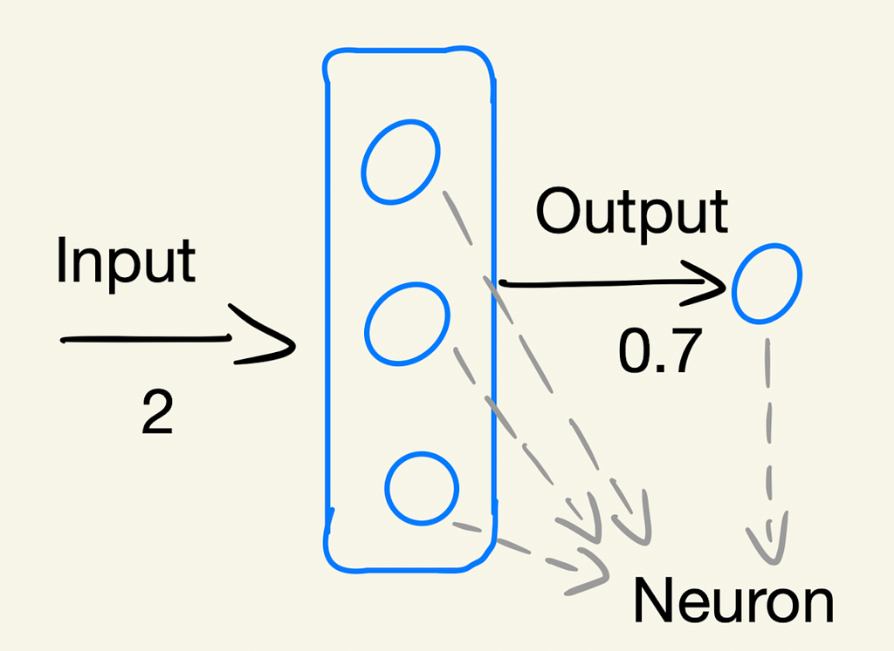
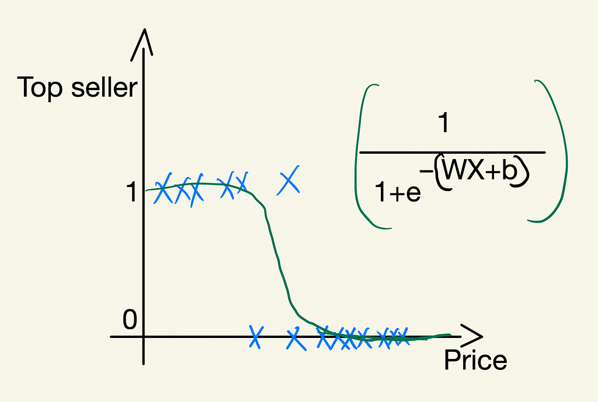
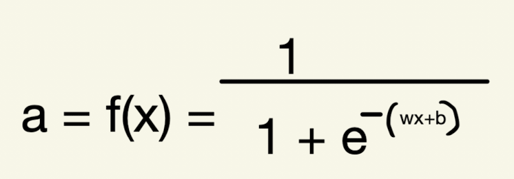
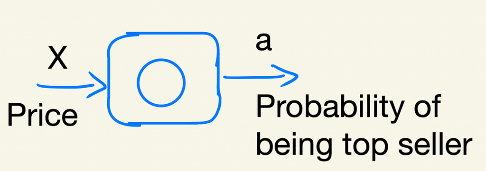
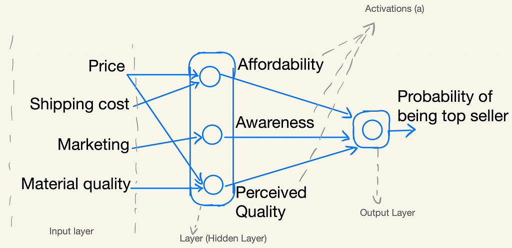
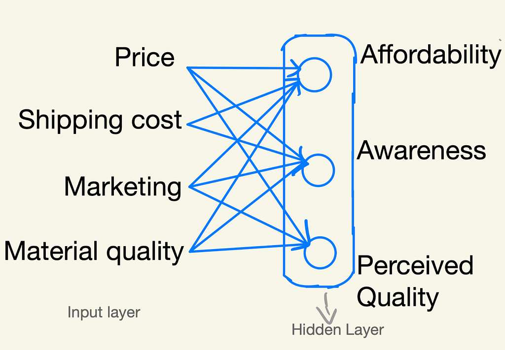
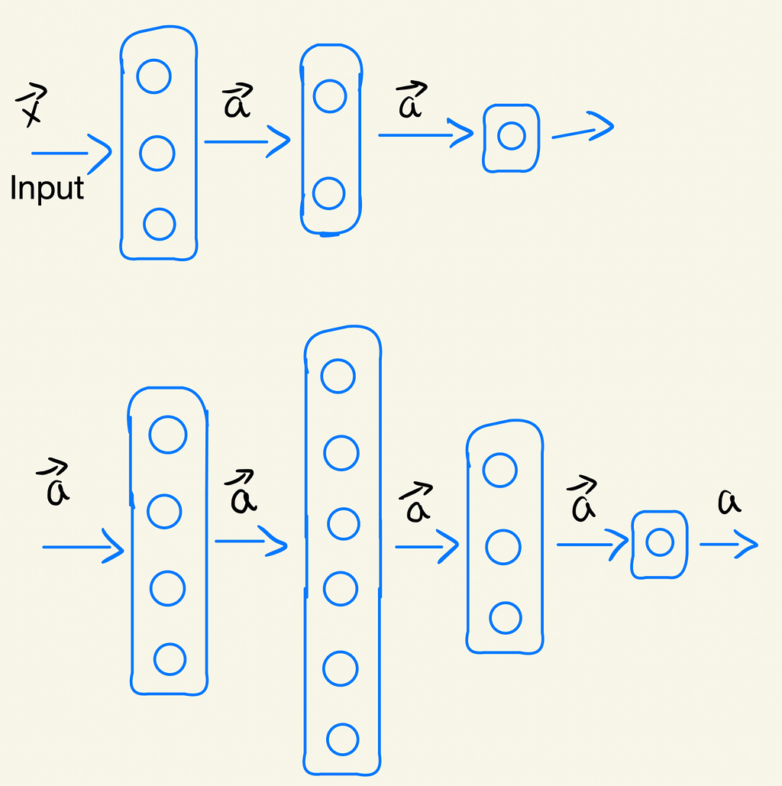
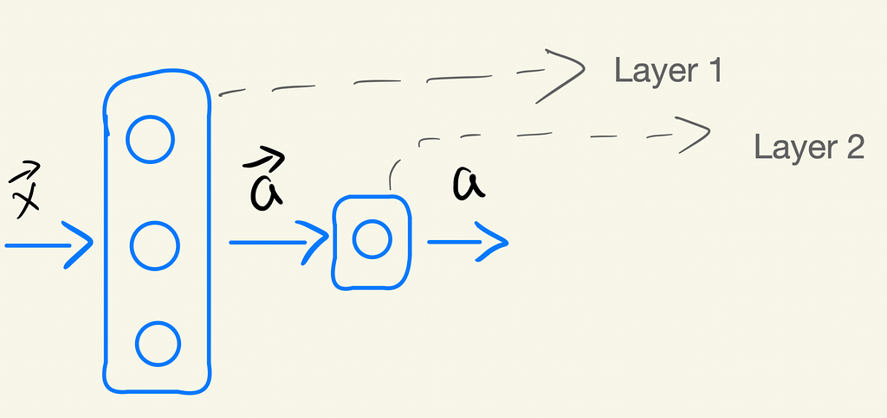
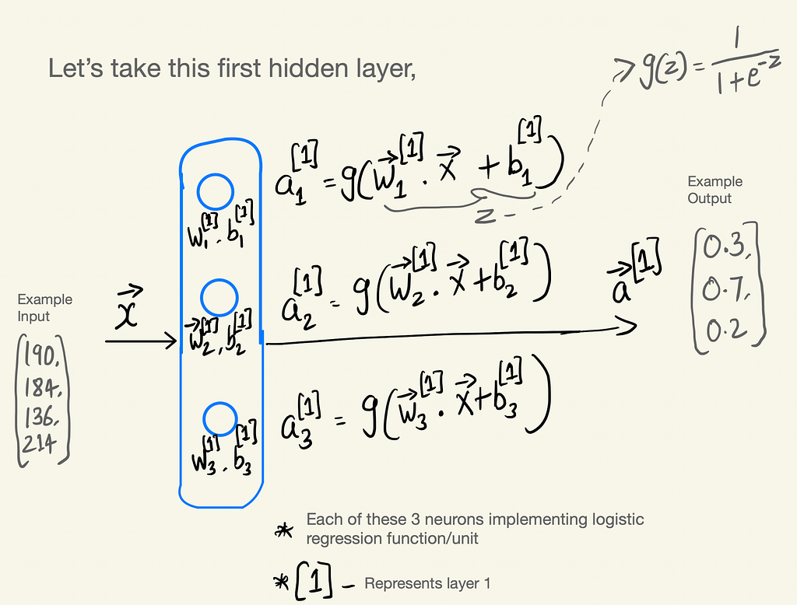
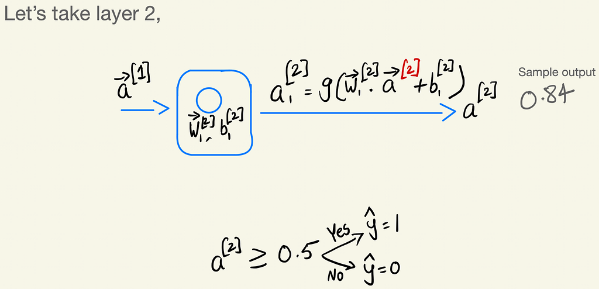

# Neural Networks Demystified

*Layers, Neurons, Activations, and Forward Propagation*

*By Arunkumar Velusamy · Jan 2026*

---

Computational model inspired by the human brain

It will be hard to put everything into one single blog. Just want to keep it simple for quick reference. For more details, go to Coursera and watch Advance Learning Algorithms by Andrew ng.

### Biological Neuron

*Biological Neuron*

### Simplified Mathematical model of a Neuron

*Mathmatical representation of neuron*

## Demand Prediction

Let's start with an example

**T-Shirt — Top seller or Not**  
Input x is price , Output is the Probablity of being top seller

*Top seller or not — Demand prediction*

Output is a probability, ranging from 0–1. Then apply logistic regression to fit sigmoid function to the data. If you want to understand more about sigmod function or logistic regression, [click here & read the previous blog](https://medium.com/@arun003.v/supervised-machine-learning-classification-7a7681f9e850)

*logistic regression*

### Represented using one single neuron

*Single neuron example of Demand prediction*

Building a neural network just requires a bunch of these newrons and putting or wiring them together.

### Expanding Demand prediction with more features

T-shirt top-seller prediction with more input features

*Demand prediction with multiple neurons and features*

**Activations**: Afforablity, awareness, perceived quality are the activations of the three neurons in first layer. Probablity is the activation of the neuron in the last layer.  
The term activation comes from biological neurons. Sending many electrical impulses to other neurons / to the downstreams.

**Output layer:** Last layer which gives the final output.

**Input layer**: Input values. Price, shipping cost, Marketting, material quality are the Input layer here.

**Hidden layer:** Layers in the middle. Because these layer are not using the x values from the training set and also not producing y values at the same time.

### Simplification

We had to go through the neurons one at a time and decide what inputs it would take from previous layer.  
Ex: Affordability is a function of just Price and Shipping Cost, Awareness is a function of just marketing and so on.  
In large neural network, It is lot of work to go through each neuron manually and decide which neuron should take which features as inputs.

So simplified is presented in below image. Each neuron in a layer will have access to every feature, to every value from previous layer.

*Simplified version demand prediction*

Affordability will learn to ignore marketing and material quality

### Multiple hidden layer

*Multiple hidden layer representation*

How many hidden layers? and How many neurons in each layer? **Architecture of the neural network** will decide and answer these questions.

## Neural Network Layer

We just went through what is neurons, layers activations and so on. Now let's go through the logistic regression with each layer and neurons.

*Neural Network Layer*

*First hidden layer in detail*

*Second layer in details*

### Forward Propagation

Data pass in forward direction layer by layer in neural network as explained above. This is called Forward Propagation.
