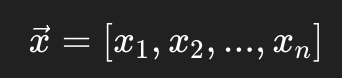

# Multiple Linear Regression

*Vectorization, Feature Scaling, and Polynomial Regression*

*By Arunkumar Velusamy · Jul 2025*

---

[Read the previous blog](https://medium.com/@arun003.v/machine-learning-get-start-b6db7076e7ad) before start this

## Multiple feature

When you started having multiple features, your function will become bigger. For example, To predict house price, we can use the features, size of the house, number of bedrooms,size of the area, number year old, number of floors and etc. your function will be like,

## Vectors

We can use vector representation to write the above equation in simple. Below is single training example with multiple features

## Vectorization (Vector Operation)

Instead of doing math one number at a time (scalar operations), you can operate on the **entire vector** at once.

### Why Is This Faster? Parallelization!

Your **CPU** (and even more so, your **GPU**) is designed to do operations on **multiple numbers at once**  
CPUs use **SIMD** (Single Instruction, Multiple Data)  
GPUs take this to the extreme — Thousands of cores handle huge vectors/matrices in **parallel**.  
NumPy, PyTorch ,TensorFlow, Scikit-learn uses vectorization

### Gradient Descent: Where It Benefits

- Computing predictions `f(x) = w^T x + b`
- Computing the cost function
- Computing gradients for **all training examples** in one shot (batch gradient descent)
- Updating weights

All of these can be **fully vectorized** — meaning no for loops, just **matrix math**.

## Feature scaling

Feature scaling means transforming the input features (your x values) so that they are on a similar scale — usually:

- Mean around **0**
- Values roughly between **-1 and 1**, or **0 and 1**

## Checking gradient decent for convergence

To check if gradient descent is converging:

- Plot the cost function vs iterations — it should decrease and flatten out.
- Monitor the change in cost — stop if it changes very little (e.g., < 1e-6).
- Check if gradients are near zero — means you've reached a minimum.
- If cost is oscillating or increasing, the learning rate may be too high**.**

## Choosing the learning rate

Choosing the right learning rate (α) is key in gradient descent — too small makes learning slow, too large makes it unstable or diverge. Start with a moderate value like 0.01 and adjust based on how the cost function behaves. Plotting cost vs iterations helps you fine-tune it.

## Feature engineering

Feature engineering is the process of transforming raw data into meaningful inputs (features) that help a machine learning model learn better and perform better.

In simple terms, *You take your raw data, apply your domain knowledge, and create features that highlight the most important patterns for the model.*

### Key Types of Feature Engineering Tasks

- Feature Creation
- Feature Transformation
- Feature Encoding
- Feature Selection

Some of the common mistakes to avoid,

- Overengineering: Too many features may cause overfitting.
- Data leakage: Creating features that unintentionally use future or target information.
- Ignoring domain knowledge: Some insights only make sense if you understand the business context.

## Polynomial regression

let you fit curves, non-linear functions, to your data.

### Why Use Polynomial Regression?

Sometimes, data doesn't follow a straight line. For example:

- Predicting housing prices might involve nonlinear patterns (e.g., prices rise rapidly after a threshold size).
- Modelling growth curves or demand trends over time.

A straight line can underfit, but a polynomial curve can capture more complex patterns.
