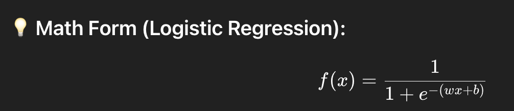
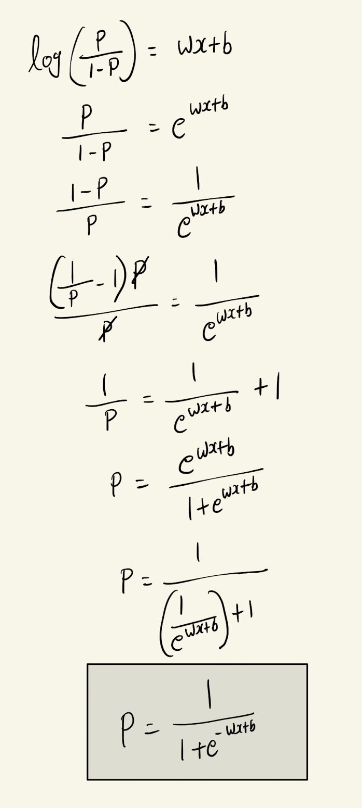
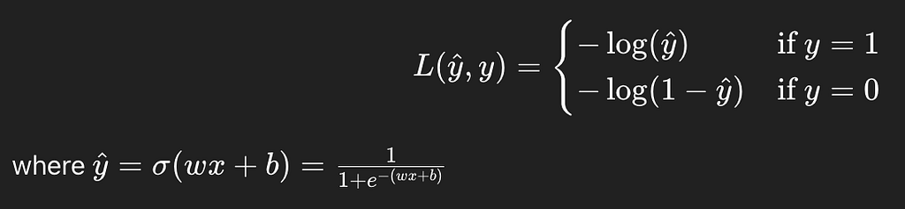
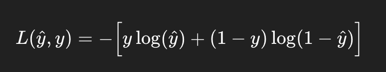
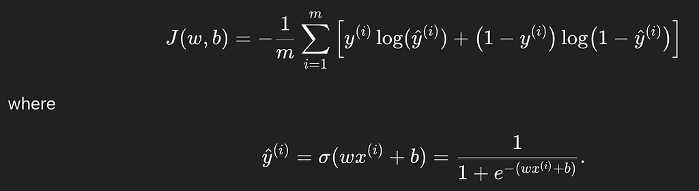

# Supervised Machine Learning — Classification

*By Arunkumar Velusamy · Sep 2025*

---

## Logistic Regression & Classification

### From Sigmoid Functions to Decision Boundaries

Classification is about predicting categories or labels, not continuous values. Instead of predicting a number like price (regression), you predict which class something belongs to.

### Example Scenarios

- Email → spam or not spam (binary classification)
- Image → cat, dog, or bird (multi-class classification)
- Loan application → approve or reject

## Difference from Regression?

Regression output is a continuous value. For example, predicting temperature. Classification output is a discrete class.For example, predicting sunny/cloudy/rainy. Classification uses **Logistic Regression** (not linear) whereas Regression uses Linear Regression.

Classification uses Sigmoid or logistic function

## Why this Math Form for Classification? Logistic regression?

*Why this Math Form for Classification? Logistic regression?*

### Probability range from 0 to 1

In linear regression, we had **f(x)=wx+b**. f(x) could be any real number. This was fine for predicting continuous values like prices or temperature. But in classification we want **probabilities** between 0 to 1. So we need a function that takes any real number(because wx+b can be anything) and squeeze it into [0,1]

### P ≠ wx+b

Since classification is a probablity(P) ranges from 0 to 1,  
**P ≠ wx+b**, becauase wx+b could be any real number

### odds make probablity range [0,1] into [0,∞]

**odds = Probability of success / Probability of failure**  
Can be written as below,  
**odds = P / 1-P**

### log(odds) turns [0,∞] into [-∞,∞]

log(p/(1-p)) = wx+b

### why linear(wx+b)?

Simplicity : linear equation are easy to estimate and interpret  
Flexiblity: after applying the inverse(sigmoid), we get a smooth S-Shaped curve for probablities.  
Efficiency: Solving for w,b becomes an optimization problem with nice properties(convexity)

### So to be keep it short

For a given input x, the output y has to be in between 0 to 1. Sigmoid function will do this.

### Now back to school 🙂

## Decision Boundary

A decision boundary is the line or surface that separates different classes in your input space. It defines where the classifier changes its prediction from one class to another.

We have,
- Linear decision boundaries
- Non-Linear decision boundaries

No-Linear decision boundaries can be a circle or eclipse or even more complex which does not have any formal shape.

## Cost function for logistic regression

If we try to use the same MSE(Mean squared error) cost as linear regression for this this sigmod or logistic regression, we will get weird curves with flat regions and optimization becomes harder, sometimes slower.

In logistic regression, target y is binary(0 or 1), not any real number like in linear regression. So using MSE here is mathematically inconsistent. If **logistic loss**, fast learning, right assumptions.

### Loss function

*for a single training example*

Simplified version in one equation

*Simplifies version for a single training example in one equation*

If you assume y=1 or y=0 and apply in the above equation, you can understand the simplification

Cost function for logistic regression (for m training sets)

*Cost function for logistic regression (for m training sets)*

### Gradient descent algorithm

to find good choice of w & b

Gradient descent formula of logistic regression look same as linear regression. But the difference is hidden in f(x). f(x) is different for logistic regression.

End. But Read about overfitting and underfitting
